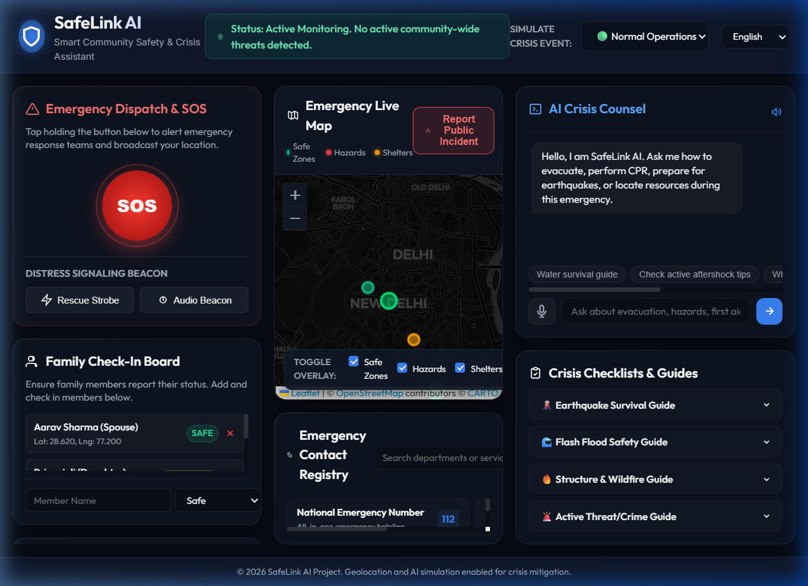
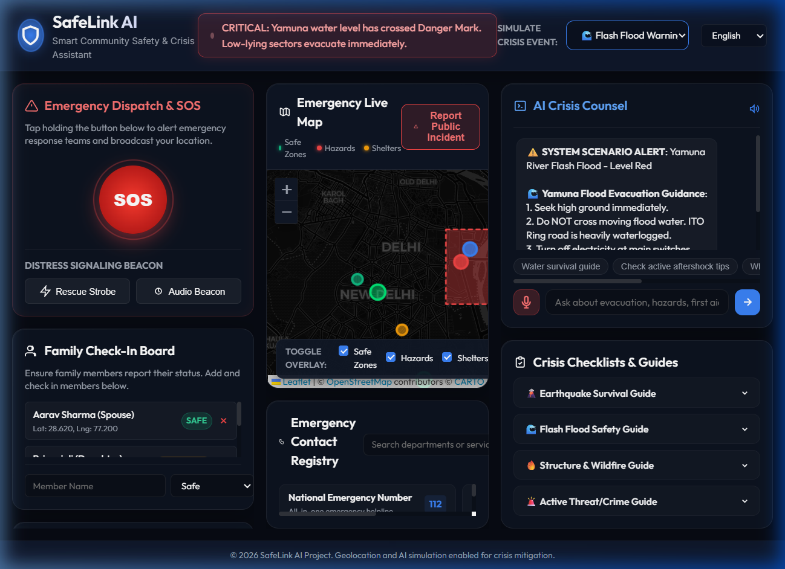
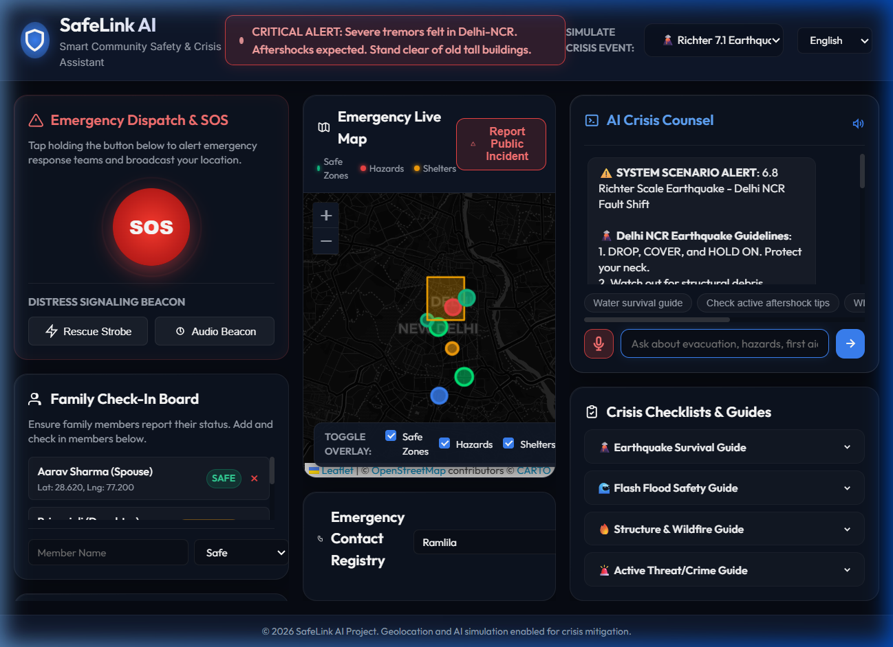

# SafeLink AI – Smart Community Safety & Crisis Assistant

### 🌟 Track: Agents for Good

When emergencies, crimes, missing-person cases, or public safety incidents occur, communities face critical information gaps:
* **Confusion**: Where the nearest safe zone, shelter, or hospital is.
* **Friction**: How to contact emergency services quickly and transmit coordinates.
* **Information Delay**: Whether an area is currently safe or active hazards exist nearby.
* **Under-reporting**: How to report incidents effectively to alert neighbors.
* **Panic**: What exact actions to take in critical situations.

**SafeLink AI** is an intelligent, high-fidelity emergency support assistant that empowers citizens with real-time safety info, emergency resource directories, voice-guided AI crisis counsel, distress beacon tools, and community incident reporting.

---

## 📸 Screenshots & Interface

### 1. Application Dashboard (Initial Loaded State)
A midnight-blue glassmorphic dashboard showcasing the Live Emergency Map centered in New Delhi, India:


### 2. Live Alerts & Yamuna River Flood Simulator
Activating the Flash Flood scenario triggers heatmaps, alerts, and NDRF evacuation camp coordinates:


### 3. AI Crisis Counsel & Delhi-NCR Earthquake Simulator
Asking the chatbot for emergency hospitals during the Earthquake simulator:


---

## ⚡ Core Features

### 🗺️ Geolocation Live Map
* Powered by **Leaflet.js** and **CartoDB Dark Matter** for a premium, responsive dark-themed geographic interface.
* Renders transparent color-coded **Seismic/Flood Hazard Heatmaps** (Red/Amber/Blue).
* Automatically plots **Safe Assembly Zones** (Green), **Emergency Shelters** (Orange), and **Active Hazard Points** (Red).
* Pinpoints family members' coordinates and user-submitted incident reports in real time.

### 🚨 Crisis Event Simulator
Allows local authorities or testers to simulate active disaster states at the click of a button:
1. **Normal Operations**: Routine safety alerts and NDMA monsoonal monitoring.
2. **Yamuna River Flash Flood**: Alerts for low-lying areas, ITO waterlogging closures, and DND Flyway Relief Camp coordinates.
3. **Delhi-NCR Richter 6.8 Earthquake**: Connaught Place masonry collapse warning, AIIMS Emergency Trauma Centre guides, and Ramlila Maidan Assembly directions.
4. **Northern Grid Power Blackout (45°C Heatwave)**: Energy conservation alerts, hydration protocols, and solar-generator-powered cooling camps.

### 📞 Indian Emergency Directory (112)
* Built-in direct dispatch for critical services: **National Emergency Line (112)**, Delhi Police (100), Fire Services (101), CATS Ambulance (102), and NDMA Disaster Hotline (1078).
* Simulated out-going phone dialer popup that automatically package and transmit the user's **live GPS Coordinates** and safety status to rescue operators.

### 🔊 Distress Signaling Beacon (Synthesizer & Strobe)
* **Audio Beacon**: Utilizes the **Web Audio API** (`OscillatorNode` / `GainNode`) to synthesize a sweeping analog distress siren (ranging from 500Hz to 1200Hz) designed to penetrate urban rubble and background noise. Features customizable frequency and volume.
* **Rescue Strobe**: Full-screen high-frequency strobe flasher (white/yellow alternations) to signal search and rescue teams or helicopters in low-visibility environments.

### 🤖 AI Crisis Counsel & Speech synthesis
* Offline-first natural language processor matching keywords to rescue instructions.
* Supports **Text-To-Speech (TTS)** voice read-aloud via Web Speech Synthesis, utilizing localized accents for hands-free operations.
* Animated voice visualizer indicating status.

### 📋 Family Check-in Board & Local Checklists
* Simple interface to track family members' safety status (Safe, Sheltered, Unreachable) and map their coordinates.
* LocalStorage-backed survival checklists (e.g. Earthquake kit checklist, structure fire escapes) that save state across refreshes.

---

## 🛠️ Technology Stack
* **Frontend**: HTML5, Vanilla JavaScript (ES6+), Vanilla CSS3 (Custom design system with CSS custom properties).
* **Mapping**: Leaflet.js (CartoDB tiles).
* **Audio Processing**: Web Audio API (real-time signal generator).
* **Voice**: SpeechSynthesis API (Web Speech API).
* **Data Storage**: Client-side LocalStorage.

---

## 🏃 Run Locally

To spin up and test the project locally:

1. **Clone the Repository**:
   ```bash
   git clone https://github.com/Nancy1912-lab/safelink-ai.git
   cd safelink-ai
   ```

2. **Start a Static Server**:
   Since Leaflet and relative paths run best in a server context, start any quick static file server.
   * **Python**:
     ```bash
     python -m http.server 8080
     ```
   * **NodeJS (http-server)**:
     ```bash
     npx http-server -p 8080
     ```

3. **Open in Browser**:
   Navigate to `http://127.0.0.1:8080` in your web browser.
